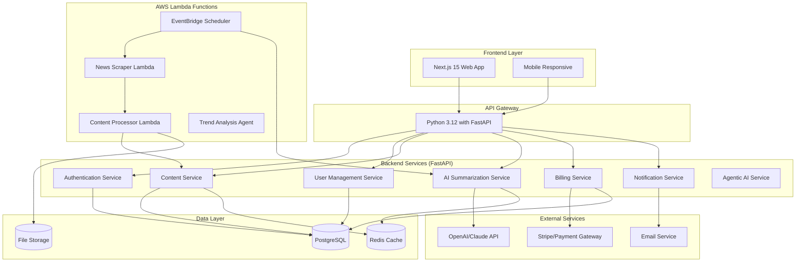

# Design Document

## Overview

The AI News Aggregator is a full-stack web application built with a microservices architecture to ensure scalability and maintainability. The system consists of a Next.js 15 frontend with Turbopack, Python 3.12 FastAPI backend services, and automated AWS Lambda data processing pipelines. The platform leverages advanced agentic AI capabilities for intelligent content curation and implements a subscription-based SaaS model with cost-optimized AWS infrastructure.

## Architecture

### High-Level Architecture



### Technology Stack

**Frontend:**
- Next.js 15 with Turbopack and TypeScript
- Node.js 22 runtime
- Tailwind CSS for consistent UI styling
- NextAuth.js for authentication
- SWR for data fetching and caching
- Shadcn/ui for consistent component library

**Backend:**
- Python 3.12 with FastAPI
- UV for dependency management (not pip)
- Pydantic for data validation
- SQLAlchemy with Alembic for database operations
- Celery with Redis for background job processing
- JWT for secure API authentication

**Database & Storage:**
- AWS RDS PostgreSQL (cost-optimized with reserved instances)
- AWS ElastiCache Redis for caching and session management
- AWS S3 for file storage with intelligent tiering

**Infrastructure & Deployment:**
- AWS ECS for container orchestration
- AWS Lambda for scheduled jobs and event processing
- Terraform for Infrastructure as Code
- GitHub Actions for CI/CD pipeline
- AWS Application Load Balancer for traffic distribution

**External Services:**
- OpenAI API / Anthropic Claude for AI processing
- AWS SES for cost-effective email notifications
- Stripe for payment processing
- RSS/API feeds for news sources

## Components and Interfaces

### Frontend Components

#### Core Components
- **Dashboard**: Main user interface displaying daily summaries
- **TopicExplorer**: Detailed view for individual news topics
- **UserSettings**: Preference management and subscription controls
- **AuthForms**: Login, registration, and password recovery
- **SubscriptionManager**: Billing and plan management interface

#### Shared Components
- **NewsCard**: Reusable component for displaying news items
- **LoadingSpinner**: Loading states throughout the application
- **ErrorBoundary**: Error handling and user feedback
- **Layout**: Common layout wrapper with navigation

### Backend Services

#### Authentication Service (FastAPI)
```python
class AuthService:
    async def register(self, user_data: UserRegistration) -> AuthResponse
    async def login(self, credentials: LoginCredentials) -> AuthResponse
    async def refresh_token(self, token: str) -> AuthResponse
    async def logout(self, user_id: str) -> None
```

#### Content Service (FastAPI)
```python
class ContentService:
    async def get_daily_summary(self, user_id: str, date: datetime) -> DailySummary
    async def get_topic_details(self, topic_id: str) -> TopicDetails
    async def get_user_feed(self, user_id: str, filters: FeedFilters) -> List[NewsItem]
    async def mark_as_read(self, user_id: str, item_id: str) -> None
```

#### AI Summarization Service (FastAPI)
```python
class AISummarizationService:
    async def generate_daily_summary(self, articles: List[Article]) -> Summary
    async def summarize_article(self, article: Article) -> ArticleSummary
    async def categorize_content(self, content: str) -> List[Category]
    async def analyze_sentiment(self, content: str) -> SentimentAnalysis
```

#### Agentic AI Service (FastAPI)
```python
class AgenticAIService:
    async def research_topic(self, topic: str) -> ResearchReport
    async def predict_trends(self, historical_data: List[Article]) -> TrendPrediction
    async def validate_sources(self, sources: List[NewsSource]) -> SourceCredibility
    async def generate_insights(self, user_profile: UserProfile) -> PersonalizedInsights
```

### Data Processing Pipeline

#### News Scraper
- Scheduled job that runs every 2 hours
- Fetches content from configured RSS feeds and APIs
- Implements rate limiting and error handling
- Stores raw articles in database with metadata

#### Content Processor
- Processes raw articles for quality and relevance
- Deduplicates similar content using text similarity
- Extracts key information and metadata
- Triggers summarization for high-quality articles

## Data Models

### User Model
```typescript
interface User {
  id: string
  email: string
  passwordHash: string
  preferences: UserPreferences
  subscriptionTier: SubscriptionTier
  createdAt: Date
  updatedAt: Date
}

interface UserPreferences {
  topics: string[]
  deliveryTime: string
  emailNotifications: boolean
  categories: AICategory[]
}
```

### Article Model
```typescript
interface Article {
  id: string
  title: string
  content: string
  summary?: string
  url: string
  source: NewsSource
  publishedAt: Date
  categories: string[]
  relevanceScore: number
  processed: boolean
}
```

### Daily Summary Model
```typescript
interface DailySummary {
  id: string
  userId: string
  date: Date
  summary: string
  topStories: TopStory[]
  categories: CategorySummary[]
  generatedAt: Date
}
```

### Subscription Model
```typescript
interface Subscription {
  id: string
  userId: string
  tier: 'free' | 'pro' | 'enterprise'
  status: 'active' | 'cancelled' | 'past_due'
  currentPeriodEnd: Date
  stripeSubscriptionId?: string
}
```

## Error Handling

### Frontend Error Handling
- React Error Boundaries for component-level errors
- Global error handler for API failures
- User-friendly error messages with retry options
- Offline detection and graceful degradation

### Backend Error Handling
- Centralized error middleware for FastAPI
- Structured error responses with appropriate HTTP status codes
- Logging integration with structured data using Python logging
- Circuit breaker pattern for external API calls using tenacity library

### Data Processing Error Handling
- Retry mechanisms for failed scraping attempts
- Dead letter queues for failed processing jobs
- Monitoring and alerting for pipeline failures
- Graceful degradation when AI APIs are unavailable

## Testing Strategy

### Frontend Testing
- Unit tests for components using Jest and React Testing Library
- Integration tests for user workflows
- E2E tests using Playwright for critical paths
- Visual regression testing for UI consistency

### Backend Testing
- Unit tests for service layer logic using pytest
- Integration tests for FastAPI endpoints using httpx
- Database integration tests with test containers
- Load testing for scalability validation using locust

### Data Pipeline Testing
- Unit tests for Lambda functions using pytest
- Integration tests with mock external APIs using moto
- Data quality validation tests for AI processing
- Performance tests for batch processing and agentic AI workflows

### Test Coverage Goals
- Minimum 80% code coverage for critical paths
- 100% coverage for authentication and billing logic
- Automated testing in CI/CD pipeline
- Regular security penetration testing

## Agentic AI Features

### Intelligent Research Assistant
- **Proactive Research Agent**: Automatically identifies trending topics and conducts deep research
- **Source Discovery**: AI agent continuously discovers new reliable AI news sources and evaluates their credibility
- **Cross-Reference Validation**: Agent verifies claims across multiple sources and flags potential misinformation

### Personalized Content Curation
- **Learning Agent**: Continuously learns from user reading patterns, time spent on articles, and feedback
- **Predictive Content**: Predicts what content users will find most valuable based on their role and interests
- **Dynamic Categorization**: AI agent creates personalized topic categories that evolve with user preferences

### Smart Notification System
- **Urgency Detection Agent**: Analyzes breaking news and determines notification priority based on user profile
- **Optimal Timing**: AI determines the best time to send notifications based on user engagement patterns
- **Context-Aware Alerts**: Sends relevant updates when user is likely to be interested (e.g., before meetings, during commute)

### Advanced Analytics & Insights
- **Trend Prediction Agent**: Identifies emerging AI trends before they become mainstream
- **Impact Analysis**: Evaluates potential impact of AI developments on different industries and roles
- **Competitive Intelligence**: Tracks company movements, funding rounds, and strategic partnerships in AI space

### Interactive AI Assistant
- **Conversational Interface**: Users can ask questions about AI developments and get contextual answers
- **Explanation Agent**: Breaks down complex AI research papers and technical concepts into digestible insights
- **Recommendation Engine**: Suggests related articles, research papers, and learning resources

### Content Generation & Enhancement
- **Multi-Format Summaries**: Generates summaries in different formats (executive summary, technical deep-dive, bullet points)
- **Visual Content Creation**: Automatically generates infographics and visual summaries of complex topics
- **Podcast Script Generation**: Creates audio-friendly content for users who prefer listening

## Security Considerations

### Authentication & Authorization
- JWT tokens with short expiration times
- Refresh token rotation
- Role-based access control (RBAC)
- Rate limiting on authentication endpoints

### Data Protection
- Encryption at rest for sensitive data
- HTTPS enforcement for all communications
- Input validation and sanitization
- SQL injection prevention through ORM

### API Security
- API key management for external services
- Request signing for sensitive operations
- CORS configuration for frontend access
- DDoS protection and rate limiting

## Scalability & Performance

### Caching Strategy
- Redis caching for frequently accessed summaries
- CDN for static assets
- Database query optimization with indexes
- Application-level caching for expensive operations

### Database Optimization
- Read replicas for scaling read operations
- Connection pooling for efficient resource usage
- Database partitioning for large datasets
- Regular performance monitoring and optimization

### AWS Cost-Optimized Infrastructure
- **ECS with Fargate Spot**: Cost-effective container orchestration with spot pricing
- **Lambda for Event Processing**: Pay-per-execution for scheduled jobs and event handling
- **RDS Reserved Instances**: Significant cost savings for database with predictable usage
- **S3 Intelligent Tiering**: Automatic cost optimization for file storage
- **CloudFront CDN**: Reduced bandwidth costs and improved performance
- **Auto-scaling Groups**: Scale based on demand to optimize costs

### Infrastructure as Code (Terraform)
- **Modular Terraform Configuration**: Reusable modules for different environments
- **State Management**: Remote state storage in S3 with DynamoDB locking
- **Environment Separation**: Dev, staging, and production environments
- **Cost Monitoring**: Automated cost alerts and budget controls

### CI/CD Pipeline (GitHub Actions)
- **Multi-stage Pipeline**: Build, test, security scan, and deploy
- **Container Registry**: AWS ECR for Docker image storage
- **Blue-Green Deployment**: Zero-downtime deployments with ECS
- **Automated Testing**: Unit, integration, and E2E tests in pipeline
- **Security Scanning**: Dependency and container vulnerability scanning